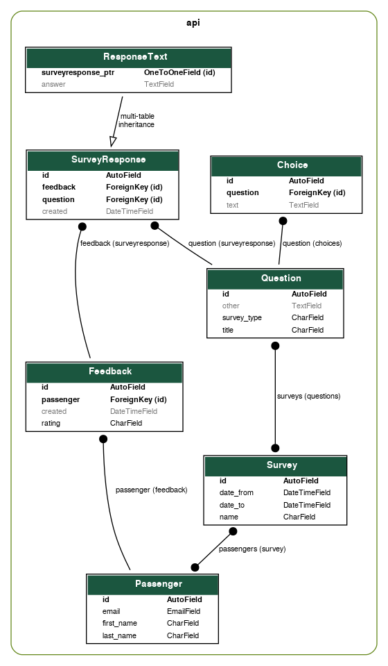

# Ride-hailing surveys app

## Getting started

### Step 1

To setup the app type:

```
$ docker-compose up
```

Once the containers are up and running visit http://localhost:8080 to interact with app.

### Step 2

In order to add some data there are **two options**:

#### Option 1 (Recommended)

Automatically add some dummy data by running:

```
$ docker-compose run --rm --no-deps backend python manage.py generate_data
```

#### Option 2

Visit http://localhost:8000 to manually add the data you need.

**Note:** You need to create a superuser first by typing:

```
$ docker-compose run --rm --no-deps backend python manage.py createsuperuser
```

## Tests

To run tests type:

```
$ docker-compose run --rm --no-deps backend python manage.py test
```

## ERD



## High level architectural diagram


